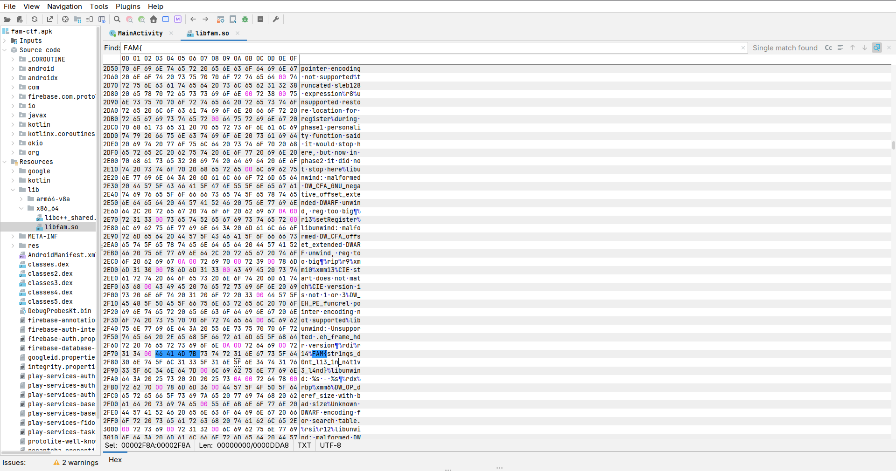

# [01] THE LIBRARY

## Challenge

> Many times devs put secrets in code and forget to remove.  
> Can you find that secret?

APK: `fam-ctf.apk`  
SHA256: `7534e6b0a665fb5c48b1a3b664274b423ca00601f77253b13220a7fe9ffb6e7c`

## Flag

```text
FAM{str1ngs_d0nt_l13_1n_n4t1v3_l4nd}
```

## Short Summary

The challenge name hints at a library. After decompiling the APK, `MainActivity` loads a native library named `fam` and calls `getSecretFromNative()` for challenge 1. Extracting `libfam.so` and running `strings` reveals the flag directly inside the native binary.

## Steps

### 1. Decompile and extract the APK

```bash
jadx -d 01_THE_LIBRARY/decompiled_jadx 01_THE_LIBRARY/apk/fam-ctf.apk
apktool d -f 01_THE_LIBRARY/apk/fam-ctf.apk -o 01_THE_LIBRARY/apktool
```

### 2. Check how the app uses native code

In `MainActivity.java`, the app declares multiple native methods and loads `libfam.so`:

```java
public final native String getSecretFromNative();

public MainActivity() {
    System.loadLibrary("fam");
}
```

`verifyFlag1()` calls `getSecretFromNative()`, which confirms that challenge 1 is tied to the native library.

### 3. Search strings in the native library

The extracted native library is located at:

```text
01_THE_LIBRARY/apktool/lib/arm64-v8a/libfam.so
```

Run:

```bash
strings -a -t x 01_THE_LIBRARY/apktool/lib/arm64-v8a/libfam.so | rg 'FAM\{|Java_com_ctf_fam'
```

Output:

```text
    cd7 Java_com_ctf_fam_MainActivity_getSecretFromNative
    ecf Java_com_ctf_fam_MainActivity_computeSignature
    fa9 Java_com_ctf_fam_MainActivity_getDebugToken
   1071 Java_com_ctf_fam_MainActivity_getUsernames
   2f99 FAM{str1ngs_d0nt_l13_1n_n4t1v3_l4nd}
```

The same hit is visible in JADX GUI when searching for `FAM{` inside `libfam.so`:



## Evidence Files

- `evidence/apk_sha256.txt`
- `evidence/mainactivity_native_calls.txt`
- `evidence/strings_libfam_arm64.txt`
- `evidence/strings_libfam_x86_64.txt`
- `evidence/readelf_rodata_flag.txt`
