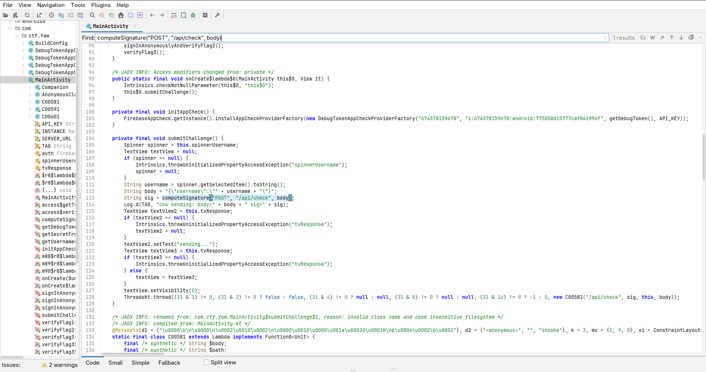
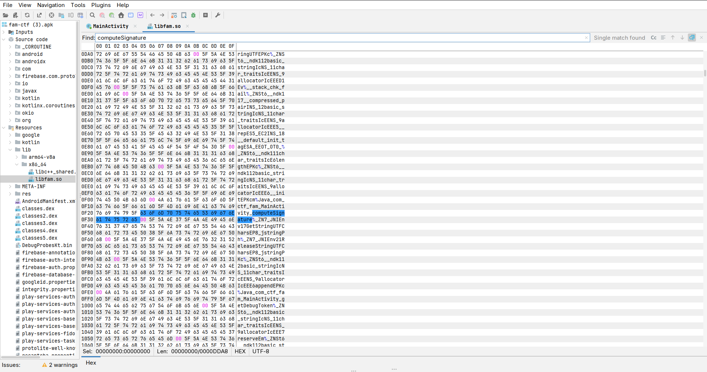
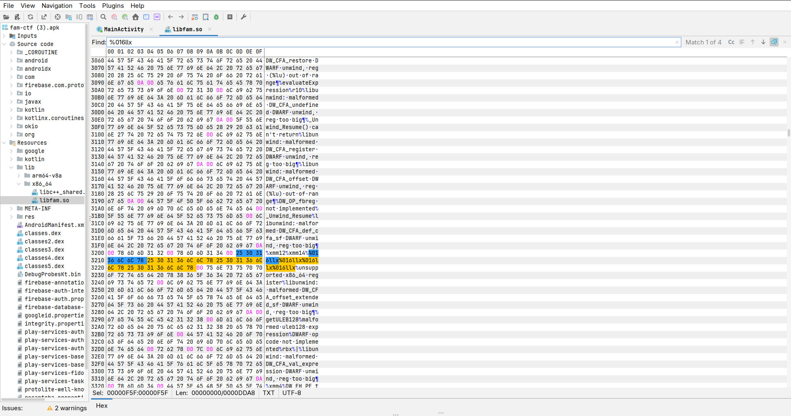
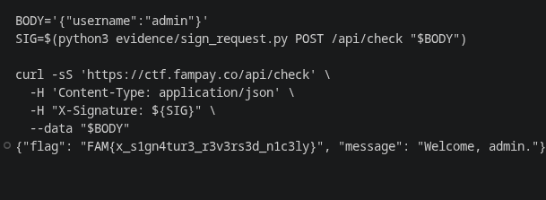

# [04] THE ENDPOINT

## Challenge

> The server only trusts what it can verify. Intercept. Modify. But can you keep it honest?
>
> hint: only admin has clearance

Endpoint: `https://ctf.fampay.co/api/check`

APK: `fam-ctf.apk`  
SHA256: `7534e6b0a665fb5c48b1a3b664274b423ca00601f77253b13220a7fe9ffb6e7c`

## Flag

```text
FAM{x_s1gn4tur3_r3v3rs3d_n1c3ly}
```

## Short Summary

The app sends `POST /api/check` with a JSON body and an `X-Signature` header. The native `computeSignature()` function signs `METHOD|PATH|BODY`, but it contains a hidden branch that corrupts the signature for the admin payload. Reversing the signature algorithm and removing that admin-specific mutation lets us send `{"username":"admin"}` with a valid signature.

## Steps

### 1. Decompile and extract the APK

```bash
jadx -d 04_THE_ENDPOINT/decompiled_jadx 04_THE_ENDPOINT/apk/fam-ctf.apk
apktool d -f 04_THE_ENDPOINT/apk/fam-ctf.apk -o 04_THE_ENDPOINT/apktool
```

### 2. Find the request flow

```bash
rg -n 'computeSignature|X-Signature|/api/check|username' 04_THE_ENDPOINT/decompiled_jadx/sources/com/ctf/fam/MainActivity.java
```

Relevant code:

```java
String body = "{\"username\":\"" + username + "\"}";
String sig = computeSignature("POST", "/api/check", body);
```

The smali for the request shows the headers:

```text
Content-Type: application/json
X-Signature: <computed signature>
```



### 3. Reverse the native signature

The native method is exported from `libfam.so`:

```bash
readelf -Ws 04_THE_ENDPOINT/apktool/lib/x86_64/libfam.so | rg 'computeSignature'
```

Disassemble the function:

```bash
objdump -d -M intel \
  --start-address=0x6440 \
  --stop-address=0x6c30 \
  04_THE_ENDPOINT/apktool/lib/x86_64/libfam.so
```

The signature input is:

```text
POST|/api/check|{"username":"..."}
```

The final signature is printed as four 64-bit hex chunks:

```text
%016llx%016llx%016llx%016llx
```



### 4. Notice the admin-specific mutation

Inside the native signer, the admin payload hits a special FNV value:

```text
0xdcc67eca15a7c732
```

When that value matches, the app XORs one signature state word with:

```text
0xdeadbeefcafebabe
```

That mutation makes the app-generated admin signature fail server verification. The server expects the same algorithm without this mutation.



### 5. Generate a valid admin signature

Use the reversed signer:

```bash
cd 04_THE_ENDPOINT

BODY='{"username":"admin"}'
SIG=$(python3 evidence/sign_request.py POST /api/check "$BODY")

echo "$SIG"
```

Output:

```text
2c64c639cabe5382ccd9fe4681277a847ef6be05f7b3aefdf685681298952188
```

### 6. Send the admin request

```bash
curl -sS 'https://ctf.fampay.co/api/check' \
  -H 'Content-Type: application/json' \
  -H "X-Signature: ${SIG}" \
  --data "$BODY"
```

Output:

```json
{"flag": "FAM{x_s1gn4tur3_r3v3rs3d_n1c3ly}", "message": "Welcome, admin."}
```



## Evidence Files

- `evidence/apk_sha256.txt`
- `evidence/mainactivity_endpoint_flow.txt`
- `evidence/smali_http_headers.txt`
- `evidence/admin_sabotage_branch_disasm.txt`
- `evidence/sign_request.py`
- `evidence/alice_access_denied.txt`
- `evidence/admin_app_signature_failed.txt`
- `evidence/admin_success_flag.txt`
